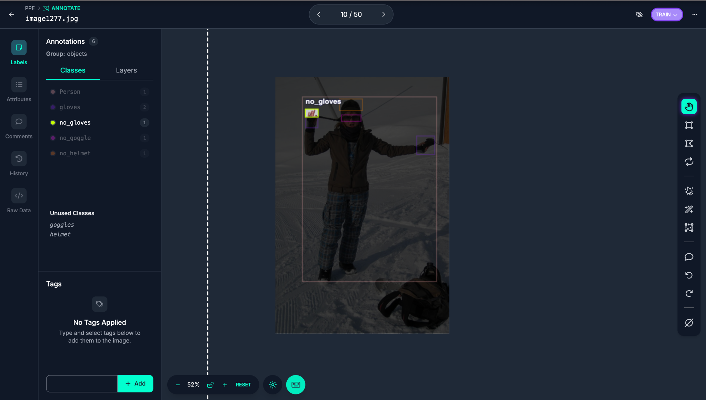
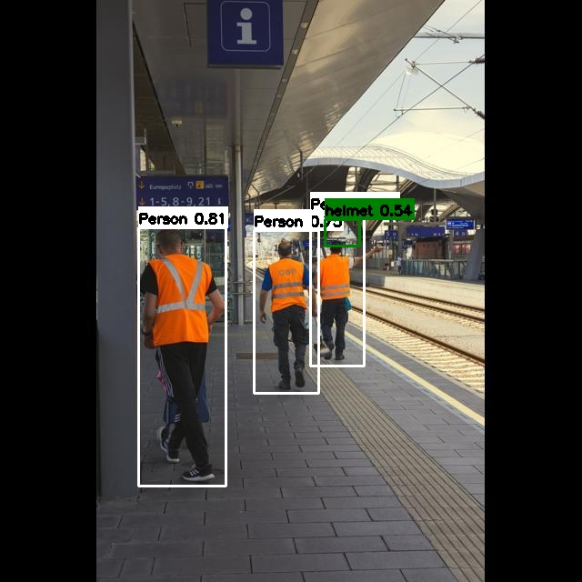
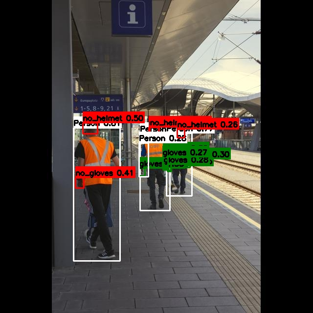

# 산업현장에서 작업자의 PPE 착용 여부 탐지

> **팀명:** KLGS (Keep Laborers Guarded & Safe)  
> **프로젝트 기간:** 2025.10.17 ~ 2025.10.24  
> **주제:** 작업자의 PPE(개인보호장비) 착용여부를 AI 컴퓨터비전 기술로 실시간으로 탐지하는 프로그램을 Streamlit으로 구현

---

## 0. 한 줄 요약

산업 현장에서 관리자가 육안으로 확인하던 PPE 착용 여부를, **YOLO11 + RT-DETR** 기반 객체 탐지로 자동화하고 **Streamlit 웹앱**으로 실시간 확인할 수 있게 만들었습니다.

---

## 1. 데모

### 1-1) 웹캠 실시간 데모


https://github.com/user-attachments/assets/10118e08-5901-4ba4-903f-97f08354e21f


### 1-2) 과정 및 결과 스냅샷

- Roboflow 작업 화면 예시


     ⠀            ⠀‣ instance의 라벨링이 누락돼 있는 경우 바운딩 박스를 쳐 라벨링하고, 바운딩 박스 위치가 어긋난 경우 조정함.

  

- 이미지상 YOLO 및 RT-DETR의 PPE 탐지 예시 (동일한 데이터셋 사용)

| YOLO | RT-DETR |
|---|---|
|  |  |


---

## 2. 문제 정의

### 2-1) 왜 필요한가?

- 건설/제조 등 산업 현장에는 안전보호장비 착용 규정이 존재함. 하지만 이를 준수하지 않는 경우가 발생하며, 소수의 안전관리자가 항상 전체 작업자의 안전보호장비 착용여부를 확인하기는 어려움.
- 적절한 안전보호장비 착용시 방지하거나 완화할 수 있는 사고가 미착용시에는 큰 상해나 인명피해로 이어질 수 있음.
- Object Detection 기술로 적합한 안전보호장비 착용 여부를 탐지, 안전관리자의 사각지대를 최대한 줄일 수 있음. 이를 통해 현장 작업자의 안전보호장비 착용률을 높여 더 안전한 작업조건을 조성하는데 기여 가능함.

### 2-2) 우리가 한 일

- CCTV 혹은 웹캠처럼 영상이 지속적으로 스트리밍되는 환경을 가정하고, **실시간 추론이 가능한 객체탐지 모델**을 사용해 PPE 착용 여부를 탐지하는 모델을 만듦.
- 최종적으로 **Streamlit**을 사용해 실제 현장에 적용 가능한 프로토타입을 제작함. 

---

## 3. 데이터셋 & 전처리

### 3-1) 원본 데이터셋

- 기본 베이스: Ultralytics Construction PPE 데이터셋
  - 특징: ‘미착용(No)’ 장비 클래스가 존재(예: no-helmet)

### 3-2) 원본 데이터셋의 한계와 개선

- 원본 데이터셋은 **라벨 누락/오표기**가 존재하고, **인스턴스별 데이터 개수의 분포**가 균일하지 않았으며 **라벨링의 품질**이 좋지 않았음.
- 개선 내용
  - **클래스 재정의:** 예측 클래스 11개 → 7개로 축소 및 정렬
  - **리라벨링:** Roboflow로 누락 박스 추가/오표기 위치 수정
  - **데이터 증강:** Roboflow를 통한 데이터 증강으로 object detection 성능 향상

### 3-3) 최종 탐지 클래스 (7개)

- `person`
- `helmet`, `no_helmet`
- `goggles`, `no_goggles`
- `gloves`, `no_gloves`

> 적절한 안전보호장비를 미착용한 사례를 탐지하여 착용하도록 안내하는 것이 중요하므로, 원본 데이터셋에서 “미착용(no-*)” 인스턴스를 면밀하게 보강함. 

---

## 4. 모델 선정

### 4-1) 선정 기준

- 현장에서 실시간으로 사용할 수 있도록 빠른 추론과 높은 정확성을 겸비해야 함.

### 4-2) 사용 모델

- **YOLO 11**
  - 장점: 빠른 추론, 낮은 자원 사용, Streamlit 연동 용이

- **RT-DETR v1**
  - 장점: Transformer 기반 구조로 복잡한 배경/작은 객체에서도 강점 기대

---

## 5. 학습 & 평가

### 5-1) 학습 파이프라인(요약)

1. 데이터셋 점검 → 클래스 개수 조정(11개→7개) 및 리라벨링(누락/오표기 박스 수정)
2. YOLO / RT-DETR 트레이닝 및 최적 파라미터 탐구, 초기 weight 활용해 모델 탑재용 Streamlit 개발 병렬 진행
3. Validation/Test 성능 비교 & 추론 예시 검증
4. Streamlit 웹앱에 최적 weight 탑재(최종 산출물)

### 5-2) 성능 관찰(정성/정량)

- 착용 클래스 대비 **미착용(no-*) 클래스의 AP가 약 0.10~0.15 낮게** 관찰됨
    ∙ 인스턴스 수가 상대적으로 적기 때문인 것으로 추청
- 유사한 구도/모델 반복 촬영으로 인한 데이터 다양성 부족
- gloves는 손 모양(펴짐/쥠), 가림(occlusion)에 민감

---

## 6. Streamlit 웹앱

### 6-1) 제공 기능(최종)

- 이미지/동영상 업로드 기반 PPE 탐지
- 웹캠 실시간 PPE 탐지
- 결과 시각화: 바운딩 박스 + 클래스 표시
    ∙ 착용: 초록색 박스, 미착용: 빨간색 박스로 표시되게 해 직관적으로 PPE 착용 여부 판단 가능

### 6-3) 로컬 실행

> 실제 레포 구조에 맞춰 경로/파일명만 맞추면 됩니다.

```bash
# 1) 환경 구성
python -m venv .venv
source .venv/bin/activate  # (Windows는 .venv\Scripts\activate)
pip install -r requirements.txt

#1-1) conda 가상환경 사용 및 cuda 버전에 맞는 PyTorch설치(Windows 기반 설명)
conda activate "virtualEnvironment name"
pip uninstall -y torch torchvision torchaudio

pip install --index-url https://download.pytorch.org/whl/cu130 torch torchvision torchaudio

#1-2) 설치 확인
python -c "import torch; print(torch.__version__); print('cuda avail', torch.cuda.is_available()); print('torch cuda', torch.version.cuda); print('gpu', torch.cuda.get_device_name(0) if torch.cuda.is_available() else 'NO GPU')"


# 2) 실행
streamlit run app.py
```

---

## 7. 레포 구조

```text
.
├─ app.py                          # Streamlit 엔트리
├─ weights/
│  ├─ yolo_best.pt                 # YOLO 가중치
│  └─ rtdetr_best.pt               # RT-DETR(v1) 가중치
├─ outputs/                        # 자동생성(비디오 결과물 저장)
├─ scripts/                        # 학습/평가/변환 스크립트
└─ assets/
   ├─ images/                      # README 이미지
   └─ videos/                      # README 데모 영상
```

---

## 8. 팀 구성 & 역할

- **공통:** Construction PPE 데이터셋 리라벨링(박스 수작업 조정), 노션 정리
- **손혁재:** Streamlit 웹앱 제작, Roboflow 데이터셋 관리
- **고현석:** RT-DETR v1 학습/튜닝, 버전별 성능 트래킹
- **곽주영:** YOLO v11 학습/튜닝, Github 페이지 관리
- **이기은:** 데이터 변환, RT-DETR v2 학습/튜닝


---

## 10. Acknowledgements

- Dataset: Ultralytics Construction PPE (https://docs.ultralytics.com/datasets/detect/construction-ppe/#dataset-yaml)
- Tools: YOLO11, RT-DETR, Python, Roboflow, Streamlit
